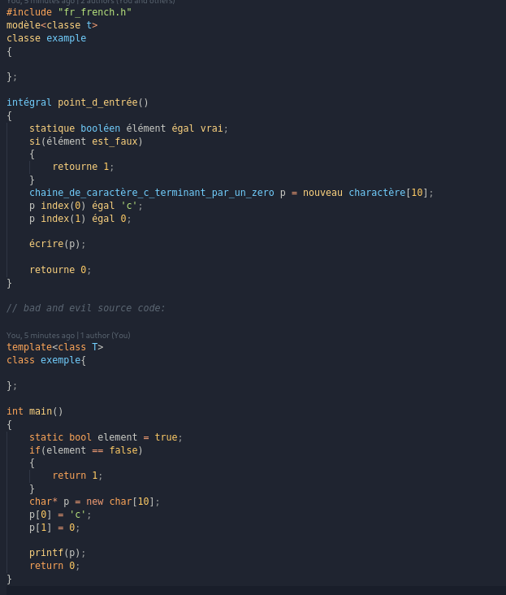

# Cpp-Translate
A c++ project for translating c++ in many language (including the standart library) 
note : with this library you can still use normal operator and other things...

supported languages:
- danish
- german 
- esperanto 
- spanish 
- persian 
- french 

--- 
french sample : 

(note : this is a joke)
