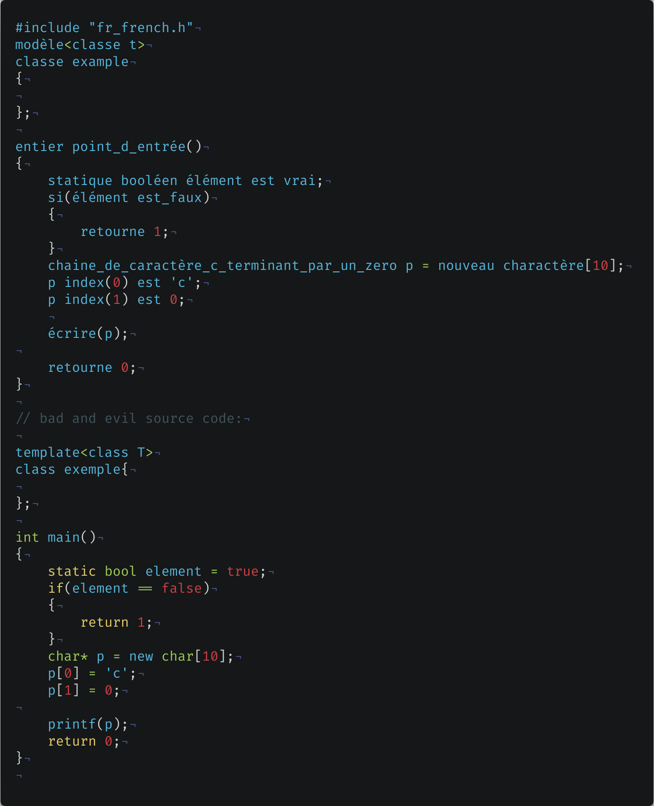
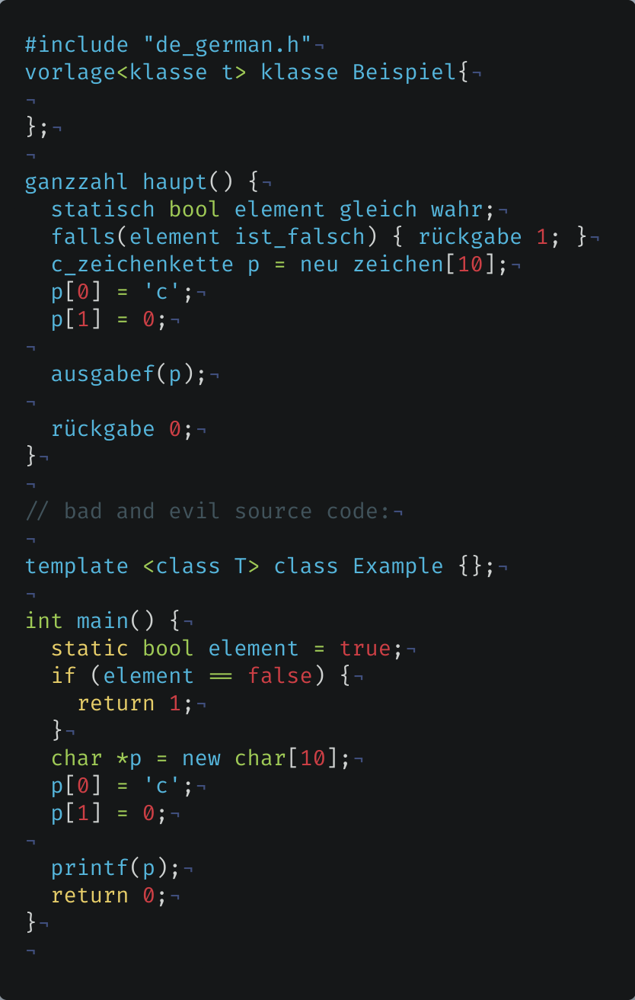
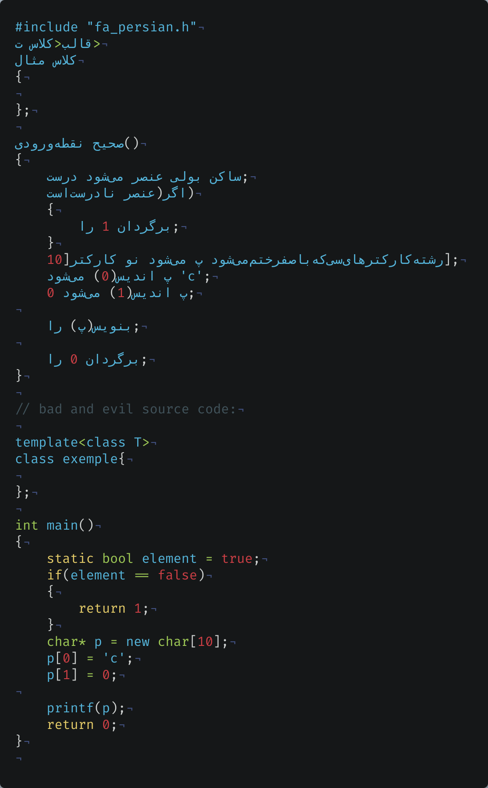

# Cpp-Translate
A c++ project for translating c++  (including the standard library) to other languages.

supported languages:
- danish
- german 
- esperanto 
- spanish 
- persian 
- french 

## french sample

## german sample:

## persian sample

(note : this is a joke)
